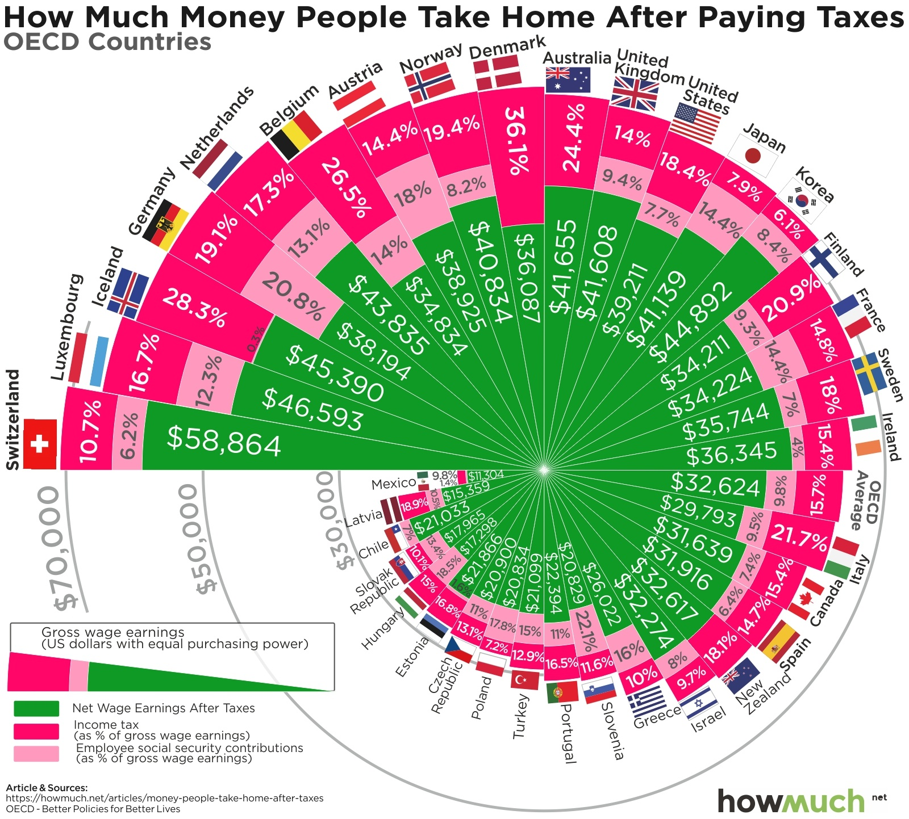
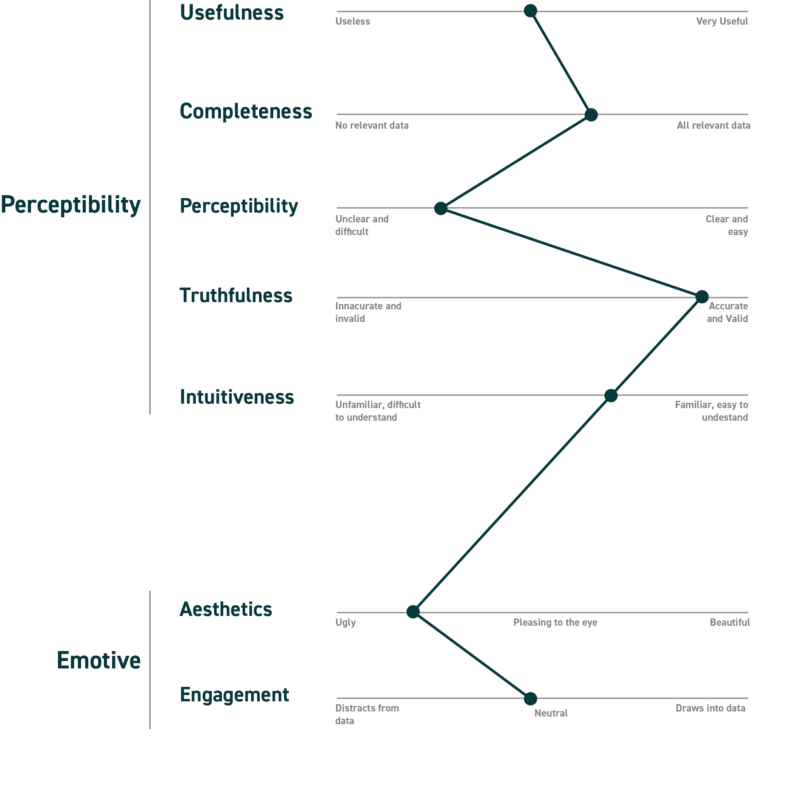

| [home page](https://cmustudent.github.io/tswd-portfolio-templates/) | [visualizing debt](visualizing-government-debt) | [critique by design](critique-by-design) | [final project I](final-project-part-one) | [final project II](final-project-part-two) | [final project III](final-project-part-three) |

# Part 1: Original Visualization

The original visualization was featured in howmuch.net, a financial educational website that makes visualizations and stories to help people make btter financial decisions. The article is titled *"See How Your Take Home Pay Compares to Workers Around the World"*, and the article intends to help Americans compare their take-home pays and taxation between 35 different countries. The data for average wage earnings and taxation figures is from the Organization for Economic Co-operation and Development (OECD). 

*"Gross earnings refer to the amount of money you get paid before anything gets taken out, like taxes, health insurance and retirement contributions. The remainder is referred to as net earnings."* - Source- howmuch.net

I chose this particular data visualization because the content that the article is so simply, but it took me a while to figure out what the graphic was saying. I thought the data represented in the article could be represented better. The visualization manages to show all OECD counntries and their respective net-home  figures and taxation details, however, I think the graph is trying to do too much.The article compares the United States net income and taxation with the top 10 countries in a separate table, which according to me, is sufficient information to convey the data. 

# Part 2: Critiquing the Visualization

While this visualization conveys all teh necessary data, the visualization is not intuitive. I didn't immediately understand what the visualization was trying to convey. 

## Breaking down the visualization:

### What worked well:
The Data has a list of 35 countries, and the graph manages to represent the approximate gross income, net income, income tax and social security tax percentages accurately. The legend in clear and the visualization is understandable but not instantly. 

### What didn't work well: 
- The graph is too cluttered as it represents all countries in the OECD list; which is not relevant for the narrative of the story.
- The colors are too bright, don't complement each-other/ convey any meaning and are extremely unpleasant to the eye
- All colors are equally bright so you don't know what to focus on
- The flags are unnecessary and add to the chaos 
- It is harder to compare the gross values in the radial hierarchy chart
-Text is oriented and sized in multiple ways making the graph extremely hard to read

### What I would do differently: 
- This story is written to an average American man, so the relevance to all countries isn't important. I would primarily work with a sub-set of this data
- The graph is trying to do too much. I would break the visualization down into smaller visualizations to convey the idea better.
- While all data from the dataset is represented, they are not relevant to the story (Ex: Social Security Contributions); I would combine that and Income tax into a single category to focus on the net-pay
- I would use sober colors to represent data that's not the highlight of the graph
- I would get rid of the flags

# Part 3: Sketching out the Solution

Upon reading the article, I realized that the two main things the visualization wants to convey is how the US compares with other countries in terms of take-home pays and the reason for the lower take-home pay. Since readers in the United States wouldn't be interested in looking at incomes or taxes of countries lower than theirs, it would make sense to work with a subset of the data. Representing all 35 countries can be chaotic. To convey this information, I would like to approach it in two parts. 

#### 1: United States' take-home pay and comparison with other countries

#### 2: United States' income tax and how it ranks amongst other countries

My approach to the redesign is simple. It uses bar charts. Although bar charts are common and overused, if used appropriately, bar charts can convey a great amount of information in an extremely simple way. By greying out information that are simply not the point of the graph, I beleive we can make the graph extremely intuitivewings the reader to focus on the content we want them to. Both graphs one and two, highlight only relevant data (net income, and income tax). Another technique to make graphs extremely intuitive is to add a title that summarizes the point of the visualization. Since readers first read the title, they immedietly understand the point that the visualization intends to make. 

# Part 4: Reviews

Without explaining the context of the visualization, I reviewed my sketches with two adults, their responses are recorded below.

### Female, mid 20's
- *Can you tell me what you think this is?*
  Shows how united states earnings and income-tax compares with countries in the world. 

- *Can you describe to me what this is telling you?*
  Switzerland has the highest net wage earnings as well as gross wage earnings, netherlands has highest but lower net wage, United states lowest net wage amongst all of them.

- *Is there anything you find surprising or confusing?*
  Korea is surprising; Has high gross incomes and high net incomes

- *Who do you think is the intended audience for this?*
  Citizens of Unites States, basically shows how united states compares with other countries in terms of Net-earnings and oay. 

- *Is there anything you would change or do differently?*
  No

### Male, late 20's
- *Can you tell me what you think this is?*
  Yes.

- *Can you describe to me what this is telling you?*
  Comparing tax rates of US vs rest of the world to show that US tax rates are among the highest; Net and gross take home for each country

- *Is there anything you find surprising or confusing?*
  The legend was below so I didn't get what the green or grey bars were

- *Who do you think is the intended audience for this?*
  General public for awareness, politicians, finance bros

- *Is there anything you would change or do differently?*
  Just keep the legend next to the plots or on top instead of below.
  
It was nice to know that people instantly understood the graph even without the context of the article and thought that it was intuitive. Reader two found visualization 1 a bit confusing at first because the legend was at the bottom and suggested that I moved it to the top.
  
# Part 4: Building the solution on Tableau
  
Incorporating changes from the reviews, I built my dashboard on Tableau. 

The visualizations are embedded below:
  

<noscript></noscript><object class='tableauViz'  style='display:none;'><param name='host_url' value='https%3A%2F%2Fpublic.tableau.com%2F' /> <param name='embed_code_version' value='3' /> <param name='site_root' value='' /><param name='name' value='OECDIncomeTax2&#47;Dashboard1' /><param name='tabs' value='no' /><param name='toolbar' value='yes' /><param name='static_image' value='https:&#47;&#47;public.tableau.com&#47;static&#47;images&#47;OE&#47;OECDIncomeTax2&#47;Dashboard1&#47;1.png' /> <param name='animate_transition' value='yes' /><param name='display_static_image' value='yes' /><param name='display_spinner' value='yes' /><param name='display_overlay' value='yes' /><param name='display_count' value='yes' /><param name='language' value='en-US' /></object>

<noscript></noscript><object class='tableauViz'  style='display:none;'><param name='host_url' value='https%3A%2F%2Fpublic.tableau.com%2F' /> <param name='embed_code_version' value='3' /> <param name='site_root' value='' /><param name='name' value='OECDIncomeTax&#47;Dashboard2' /><param name='tabs' value='no' /><param name='toolbar' value='yes' /><param name='static_image' value='https:&#47;&#47;public.tableau.com&#47;static&#47;images&#47;OE&#47;OECDIncomeTax&#47;Dashboard2&#47;1.png' /> <param name='animate_transition' value='yes' /><param name='display_static_image' value='yes' /><param name='display_spinner' value='yes' /><param name='display_overlay' value='yes' /><param name='display_count' value='yes' /><param name='language' value='en-US' /></object>

