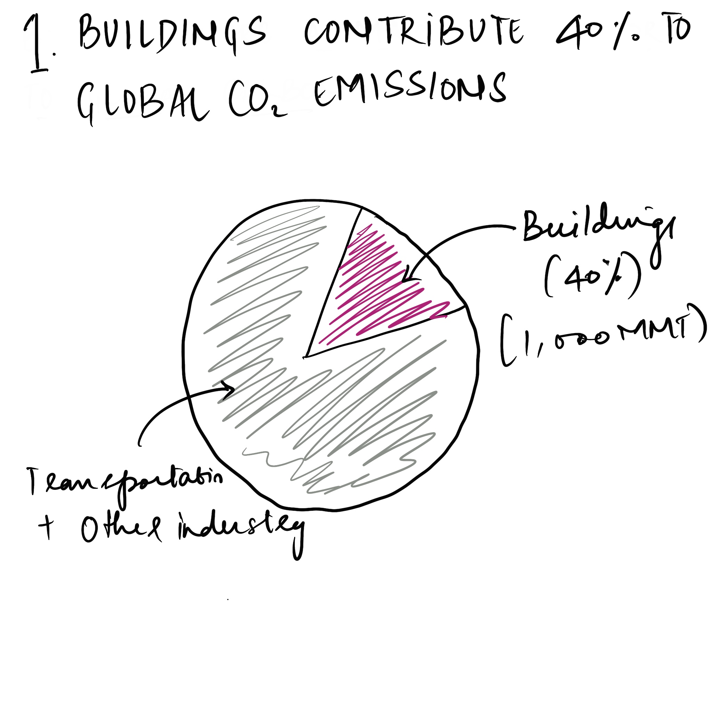
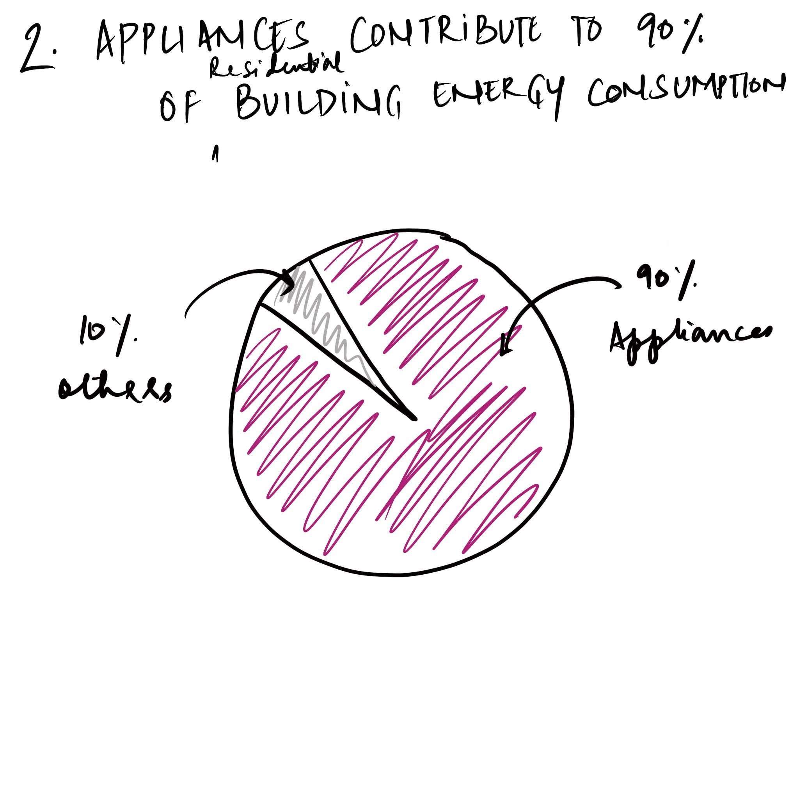
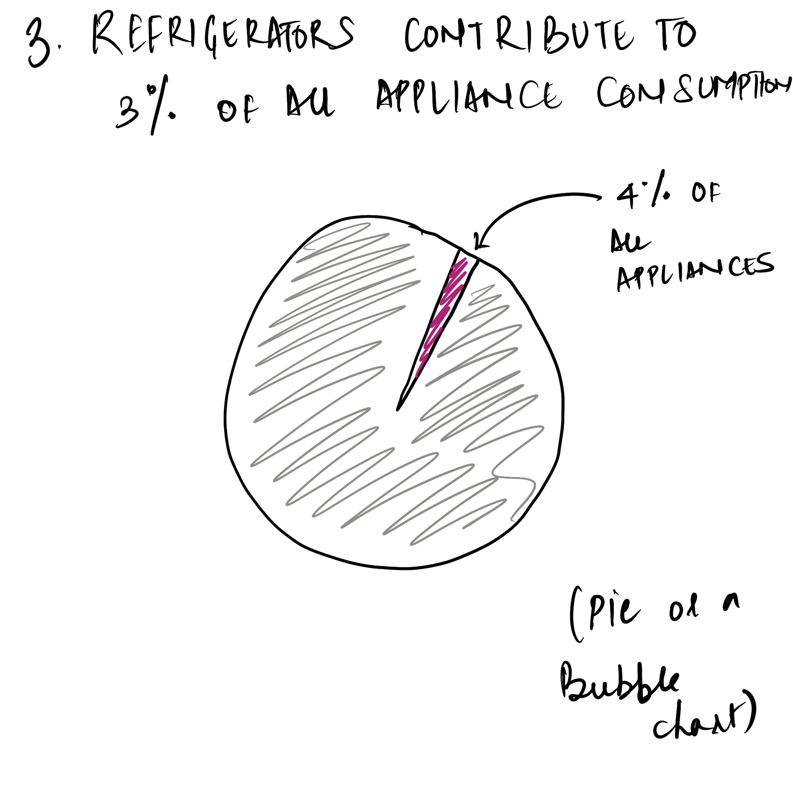
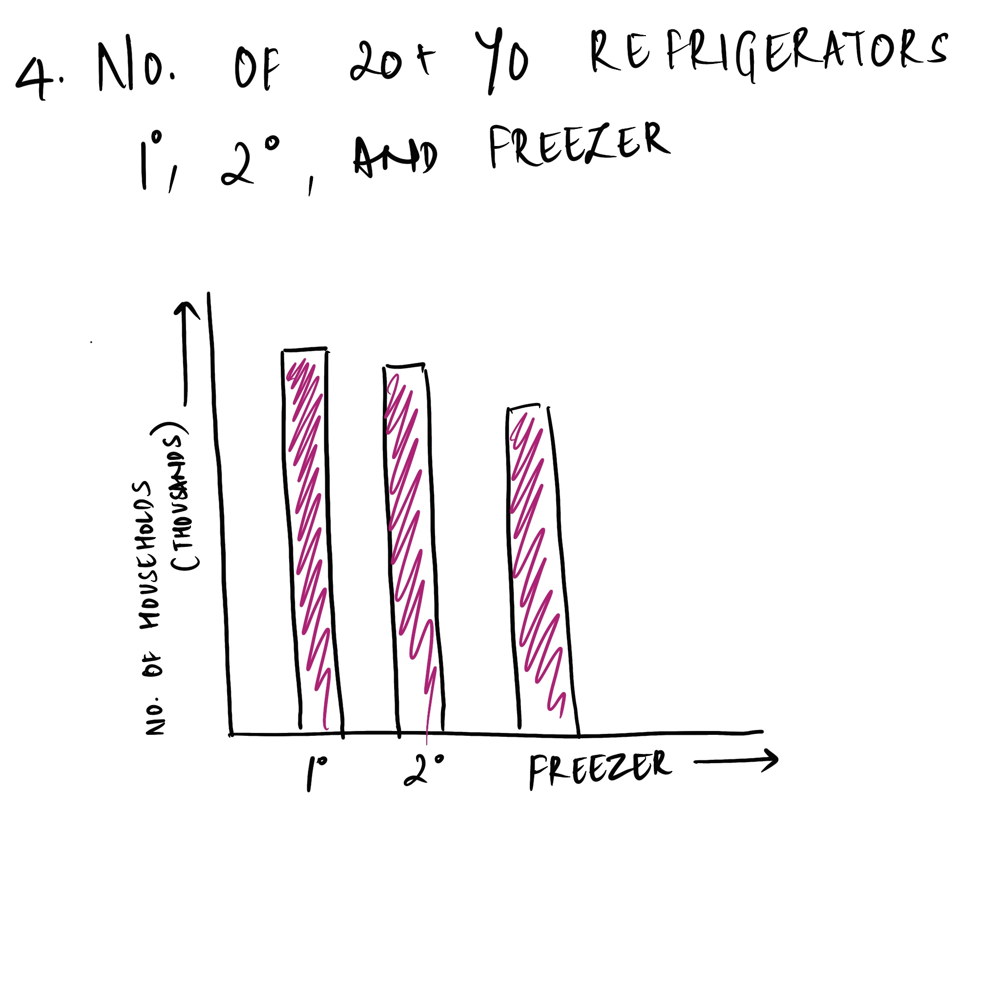
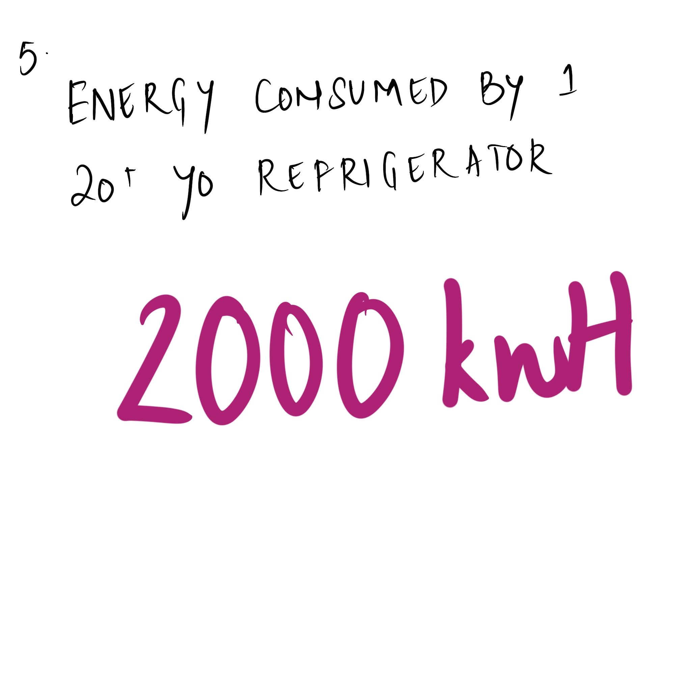
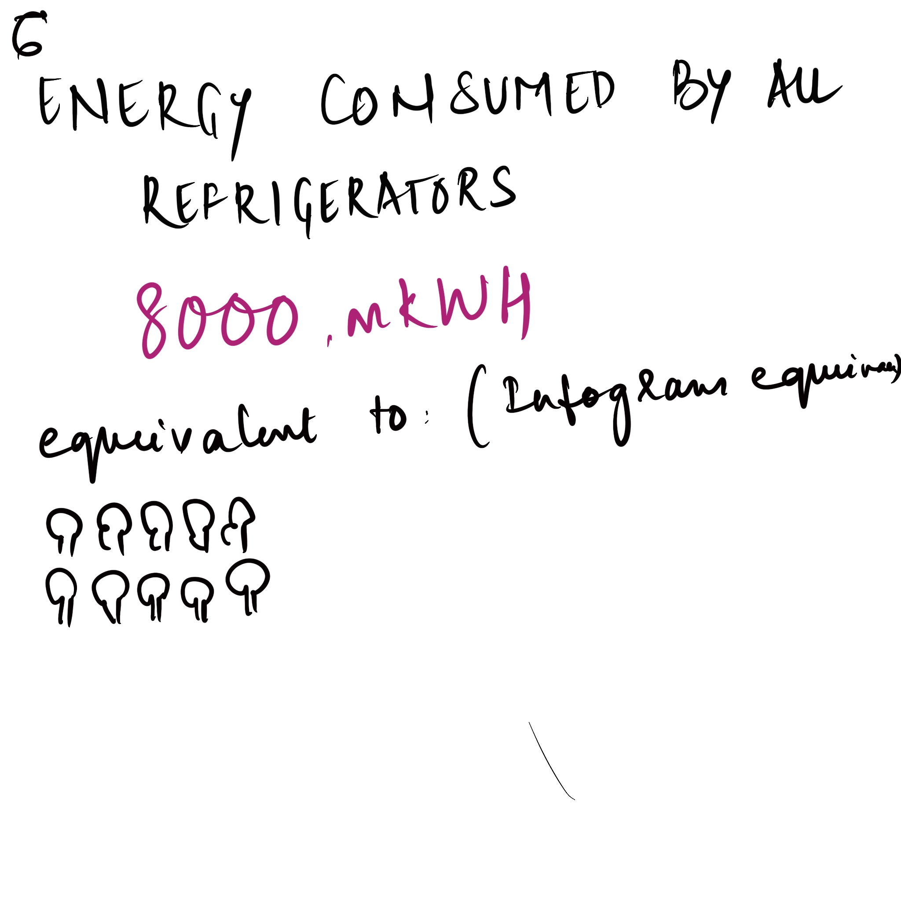
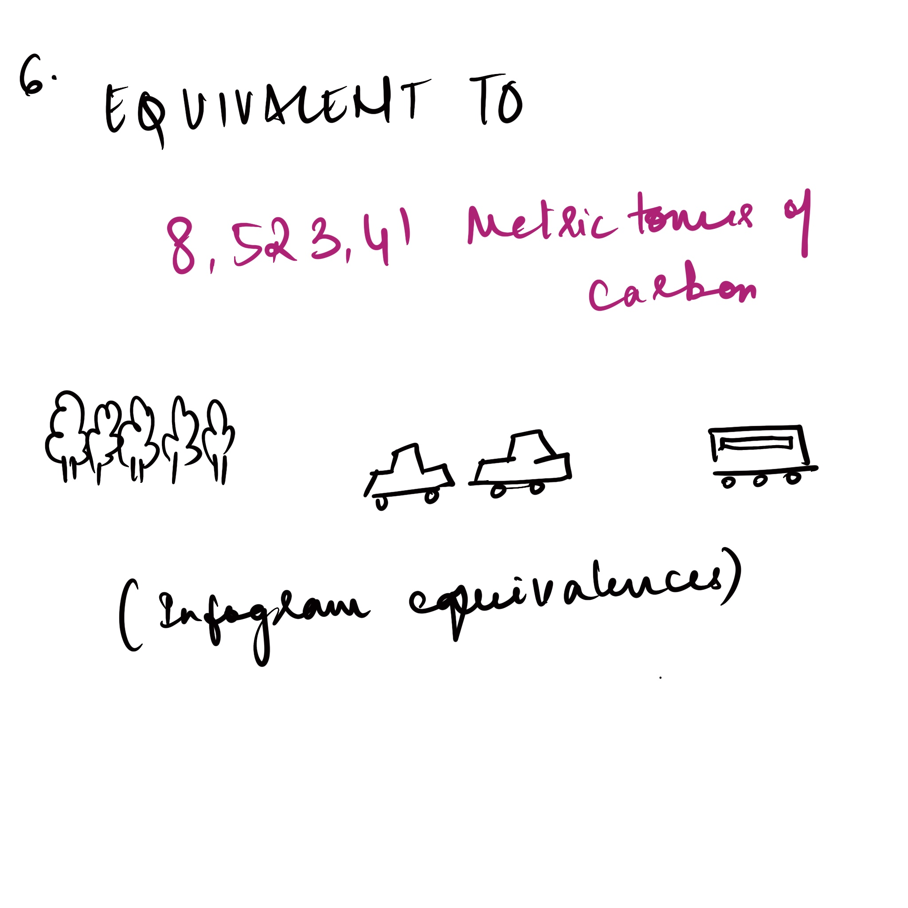
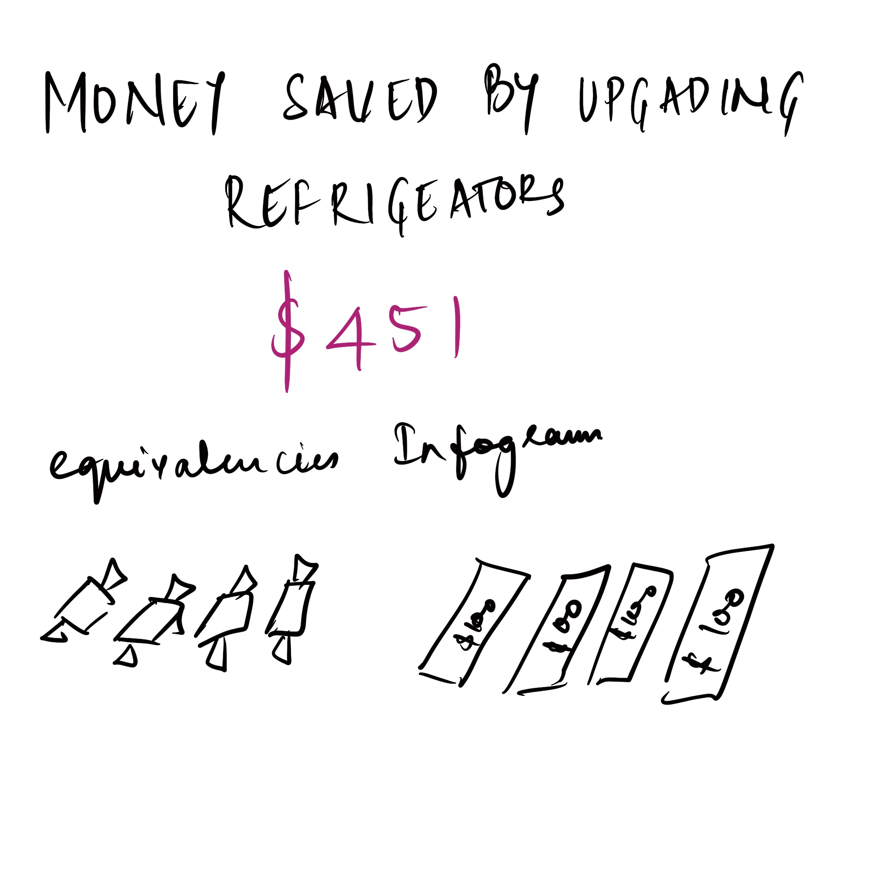
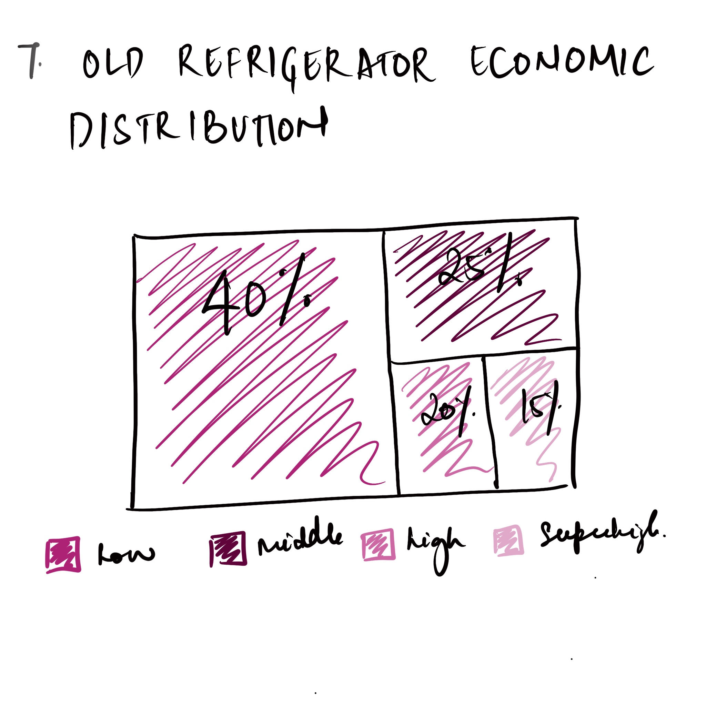
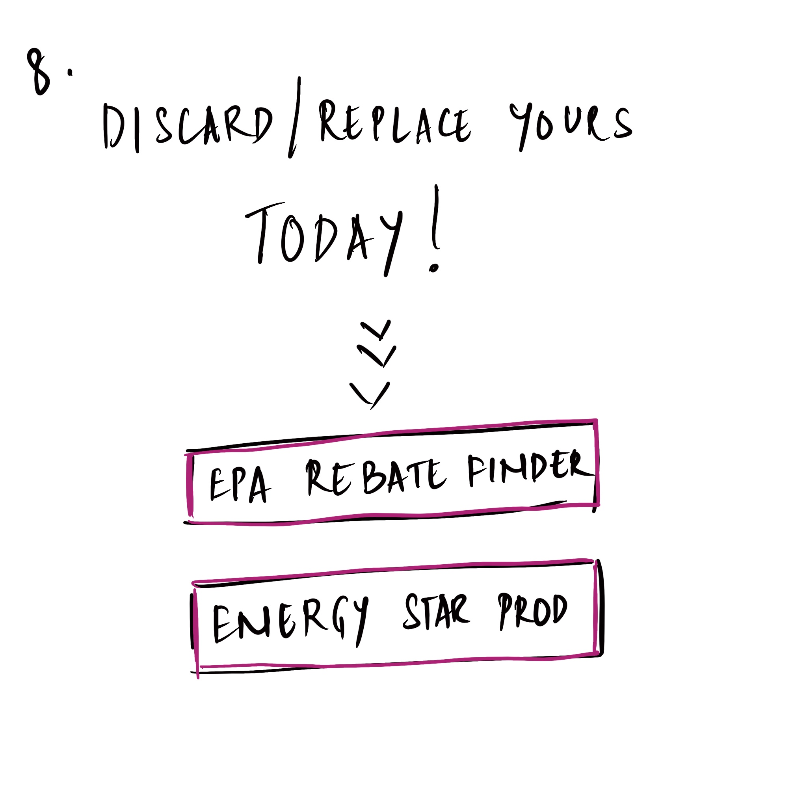

| [home page](https://cmustudent.github.io/tswd-portfolio-templates/) | [visualizing debt](visualizing-government-debt) | [critique by design](critique-by-design) | [final project I](final-project-part-one) | [final project II](final-project-part-two) | [final project III](final-project-part-three) |

# Outline
Buildings account for 40% of the United States's carbon emissions, and appliances are the major contributors to carbon emissions in buildings. Refrigerators are of great concern since they are connected to electric power 24 hours a day, year-round. Several households in the United States have old refrigerators that are functional even today simply because they are either unaware of how detrimental it is to the environment or are too poor to fix them. Through a range of visualizations, this project shows the number of old refrigerators in the United States, their energy consumption and the need to update them. This story urges readers to surrender and replace their old refrigerators with energy-plus refrigerators and directs them to financial support websites such as rebate programs proposed by the government.

### Project Structure
The project starts by introducing why buildings matter. And since appliances consume the most energy in buildings, appliances matter. The main idea that the story wants to convey is that old refrigerators consume significant amounts of power in the United States. By the end of the presentation, I urge people to discard/ replace their old refrigerators.

The sketches start broad, with the consumption of energy in buildings. The second and the third sketch shows the percentage of energy consumption by appliances in buildings and refrigerators in appliances, respectively. The fourth sketch shows the number of 20-year-old refrigerators in the country used as primary refrigerating, secondary refrigerating and freezing devices in the United States. The following drawings are infographics that convey the energy consumed by one refrigerator, all the over 20-year-old refrigerators, and their respective carbon emissions. The next couple of drawings show how the old refrigerators are distributed, urge the audience to exchange their refrigerators, and provide links to the government rebate finder and energy star refrigerator portfolio.

## Initial sketches

# The data
The primary data source for this project is going to be U.S Energy Information Agency's survey called "Residential Energy Consumption Survey (RECS) 2020". This dataset is projected from a survey that takes place every five years. This dataset covers data on energy consumption by end use, number of appliances, income groups etc. and is available on EIA's website. 

Additionally I will be using Energy Star's savings calculator, LLNL's enerrgy flows diagram (2020) and, U.S Environmental Protection Agency's (U.S EPA) Greenhousegas Equivalencies calcultor to get some information on energy usage, and carbon emissions. These are publicly available datasets. A link to these datasets are listen in the table below. 

| Name                        | URL                                                                            | Description                            |
|------                       |-----                                                                           |-------------                           |
|   EIA RECS                  | https://www.eia.gov/consumption/residential/data/2020/index.php?view=microdata |  Residential Energy Consumption Survey |
|   Flip your savings         | https://www.energystar.gov/products/appliances/refrigerators/flip-your-fridge  |  Energy Star Savings Data              |
|   Greenhouse equivalencies  | https://www.epa.gov/energy/greenhouse-gas-equivalencies-calculator             |  Carbon Emission Equivalencies         |
|   LLNL Energy flows         | https://flowcharts.llnl.gov/                                                   |  LLNL Energy Flows diagram             |

# Method and medium
From the EIA dataset, I will clean the data for rewuired information on refrigerators and visualize it using Tableau and Flourish. I plan on using Abobe illustrator for the infographics. I plan to use shorthand to put the entire presentation together and publish it. 

