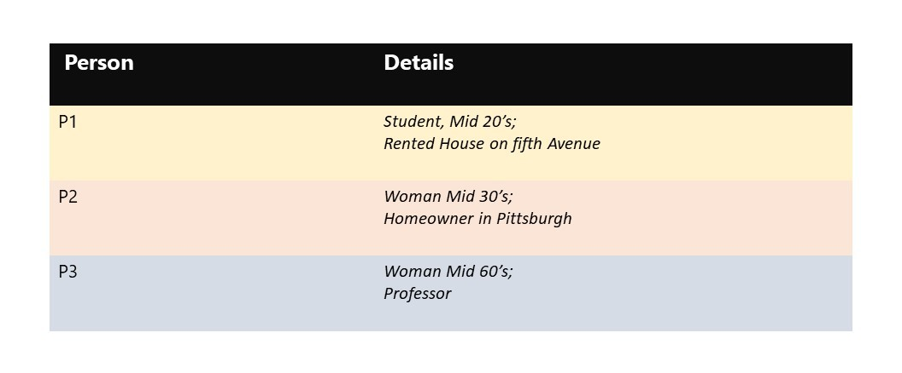
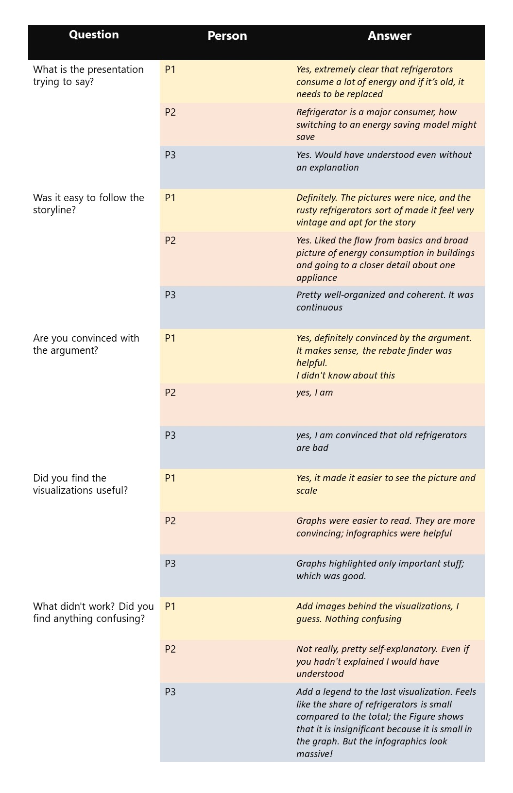
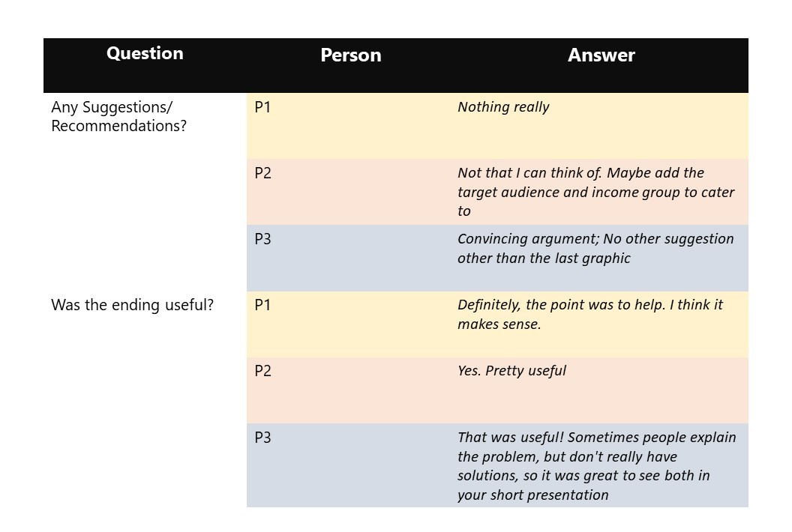
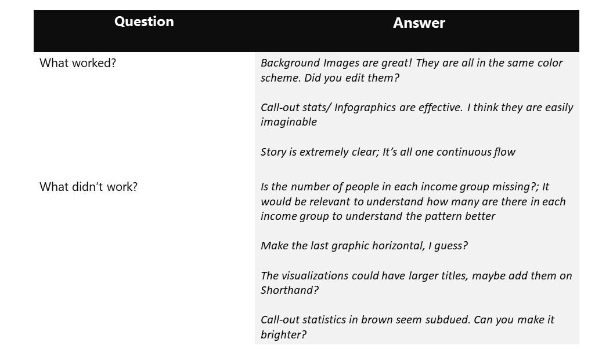
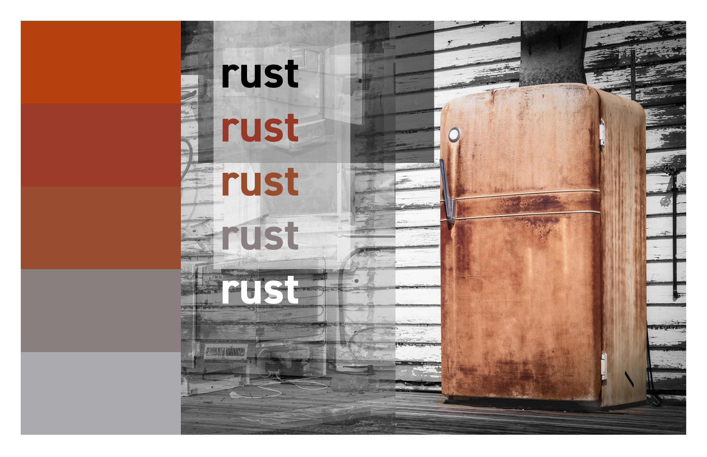

| [home page](https://meghnakshk.github.io/Analytics-Portfolio/) | [visualizing debt](visualizing-government-debt) | [critique by design](critique-by-design) | [final project I](final-project-part-one) | [final project II](final-project-part-two) | [final project III](final-project-part-three) |

# Wireframes and Storyboards

The structure for the presentation retains elements from the sketches presented in Part 1 of this project. The project begins with explaining why it is essential to care about building energy consumption; the focus of this project - residential buildings and the contribution of major appliances in a house to its energy consumption. The storyboard then explains why refrigerators are in detail, the story behind inefficient refrigerators and how replacing it will be beneficial. It links the rebates and the energy star refrigerator portfolio toward the end.

Based on the sketches done in Part 1, I constructed my basic wireframe and storyboard on Shorthand.  

## Preview: 
### [here](https://preview.shorthand.com/qJtOf6atGVFm7vKU). 

# User Research and Interviews:

The user research study in this Project aims to understand four main items:
1. The legibility of the proposed story line
2. The effectiveness of the graphics to convey information
3. The persuasiveness of the visualizations 
4. The usefulness of the call to action

### Interview Questions:
1. What is the presentation trying to say?
2. Was it easy to follow the storyline?
3. Are you convinced by the argument?
4. 	Did you find the visualizations useful?
5. 	What didn't work? Did you find anything confusing?
6. 	Any suggestions/ recommendations to improve?
7. 	Was the ending useful?

## Target Audience:

The main Target Audience for this study are different age groups. Did all age groups irrespective of their profession find this persuasive? 

### Homeowners

### Government Officials

## Interviewees:

## Interview Answers:

## In class reviews:

## Takeaways:

# Moodboards and Persona

